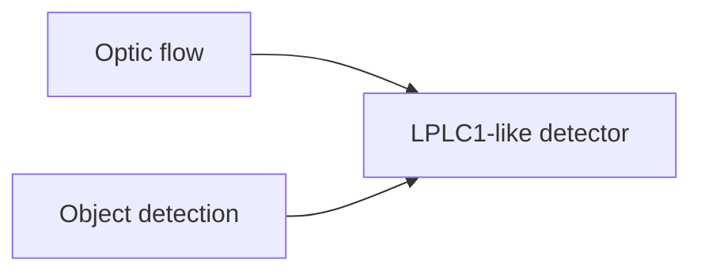

# Controller
## Goals
- (lvl 0) olfaction navigation (wk4)
- (lvl 1) rough terrain (wk2 + paper)
- (lvl 2) obstacle avoidance (wk2)
- (lvl 3) wind
- (lvl 4) threat detection and avoidance (wk4 papers on vision/wk5 papers on sexual gatings)

### Olfaction Taxis
[Elementary sensory-motor transformations underlying olfactory navigation in walking fruit-flies](https://doi.org/10.7554/elife.37815)

--> when odor is detected, commit to forward progress and steer toward the source; when odor is lost, increase turning/casting.

### Navigating Rough Terrain
[Drosophila uses a tripod gait across all walking speeds, and the geometry of the tripod is important for speed control](https://doi.org/10.7554/eLife.65878) and [Kinematic Responses to Changes in Walking Orientation and Gravitational Load in Drosophila melanogaster](https://doi.org/10.1371/journal.pone.0109204)

- reduce target speed on steep slope
- increase stance duration or reduce aggressive turning
- if body tilt or slip --> prioritise stabilisation before odor pursuit
- lower gain of odor pursuit than terrain stabilisation

### Navigating through Obstacles
[Neural mechanisms to exploit positional geometry for collision avoidance](https://doi.org/10.1016/j.cub.2022.04.023)

- obstacle looming (rapid expansion of an object's image on the retina) or risky lateral motion -->slow or stop
- obstacle stronger on left visual field --> bias right turn, and vice versa
- if multiple obstacle nearby --> obstacle layer should subsume order following layer temporarily

### Navigating through Wind

[A neural circuit for wind-guided olfactory navigation](https://doi.org/10.1038/s41467-022-32247-7)

- odor + wind --> turn to align heading against wind
- no odor but wind --> crosswind casting (zig-zag behaviour)
- reacquired odor --> reduce casting and resume upwind advance

### Detecting threats (+ avoiding "Moving Obstacle")

[Object displacement-sensitive visual neurons drive freezing in Drosophila](https://doi.org/10.1016/j.cub.2020.04.068)

[Speed dependent descending control of freezing behavior in Drosophila melanogaster](https://doi.org/10.1038/s41467-018-05875-1)

- rapid image expansion --> immediate stop or evasive turn
- threat layer should ahve highest priority and suppress odor/wind pursuit while active

Hierarchy:
- base locomotion
- odor seeking
- terrain stabilization
- obstacle avoidance
- wind-guided reorientation
- threat override
